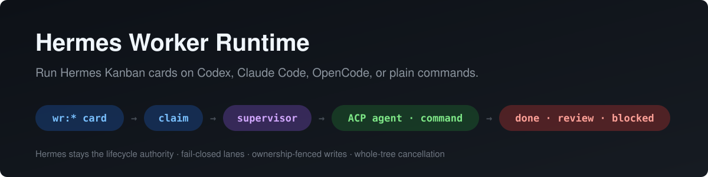

<p align="center">
  
</p>

# Hermes Worker Runtime

**Run [Hermes Agent](https://github.com/NousResearch/hermes-agent) Kanban cards on external coding agents (Codex, Claude Code, OpenCode) or on plain commands, with Hermes still in charge of every card.**

Assign a card to a lane such as `wr:codex` or `wr:tests`. The runtime claims it, runs it in the card's Hermes workspace, and records the result on the board. The result can be done, sent to review, blocked, or retried. The runtime doesn't patch Hermes and doesn't replace its orchestrator. It is one more well-behaved worker that follows Hermes' claim, heartbeat and retry rules.

[](https://github.com/chryzxc/hermes-worker-runtime/actions/workflows/ci.yml)
[](https://github.com/chryzxc/hermes-worker-runtime/releases)
[](LICENSE)
[](pyproject.toml)
[](https://github.com/NousResearch/hermes-agent)
[](https://agentclientprotocol.com)

---

## Contents

- [Why](#why)
- [Features](#features)
- [How it works](#how-it-works)
- [Quickstart](#quickstart)
- [Configuration](#configuration)
- [Agents](#agents)
- [Outcomes](#outcomes)
- [Running in production](#running-in-production)
- [Security model](#security-model)
- [Troubleshooting](#troubleshooting)
- [Development](#development)
- [Roadmap](#roadmap)
- [License](#license)

## Why

Hermes profiles are good at planning and coordinating work. Some cards are better handled
elsewhere: a large refactor by Codex, a UI fix by Claude Code, or a nightly test run by
`pytest`. Without a runtime you have two options, and both are bad:

- **Glue scripts** that shell out to agents and poke the board directly. They race
  Hermes' dispatcher and leave cards stuck in `running`.
- **A second orchestrator** with its own queue. The Kanban board stops being the truth.

The Worker Runtime avoids both. Hermes remains the only lifecycle authority, and external
executors plug in as explicit, fail-closed lanes.

## Features

| | |
|---|---|
| **Explicit lanes** | Only assignees you list are ever claimed. Hermes' dispatcher skips `wr:*` assignees because they aren't profiles, so each card has exactly one executor. |
| **One adapter, many agents** | A single [ACP](https://agentclientprotocol.com) client drives Codex, Claude Code, OpenCode, or any ACP-speaking agent. Per-agent differences come down to a pinned launch command. |
| **Deterministic lanes** | `command` lanes run tests, linters, builds or scanners from a trusted argv. |
| **Hermes-native failure handling** | Each run's supervisor is recorded as the card's `worker_pid`. Hermes' own crash detection, retry budget, rate-limit cooldown and circuit breaker apply unchanged. |
| **Ownership-fenced writes** | Every transition carries `expected_run_id`, so a stale run can never finish a newer one. |
| **Whole-tree cancellation** | Workers run in their own process group. Reclaims, timeouts and lost claims kill the whole group, and orphans are swept if a supervisor is SIGKILLed. |
| **Change evidence** | `git status` is captured before and after each run, and changed files are attached as card metadata. |
| **Restart-safe** | The runtime keeps no state; the board is the truth. Supervisors are detached, so restarting the daemon never interrupts running work. |
| **Least-privilege environment** | Children get a minimal env plus only what a lane lists. Secrets are redacted from task logs. |

## How it works

```
 Hermes Kanban board                          hermes-worker-runtime
┌────────────────────┐   poll ready wr:*   ┌───────────────────────────┐
│ ready   wr:codex   │ ◀────────────────── │ daemon (one per host)     │
│ ready   wr:tests   │ ── claim (CAS) ───▶ │  per-lane concurrency     │
└────────────────────┘                     └─────────────┬─────────────┘
          ▲                                  spawn, detached; recorded
          │                                  as the card's worker_pid
          │                                ┌─────────────▼─────────────┐
          │   heartbeat · ownership check  │ supervisor (one per run)  │
          ├─────────────────────────────── │  timeout · redacted log   │
          │                                └─────────────┬─────────────┘
          │                                   ACP session │ or argv, in the
          │                                               │ Hermes workspace
          │                                ┌─────────────▼─────────────┐
          │                                │ Codex · Claude · OpenCode │
          │                                │ pytest · ruff · make …    │
          │                                └─────────────┬─────────────┘
          │     complete / review / block                │ normalized
          └────── (expected_run_id)  or exit code ◀──────┘ result
```

1. **Discover.** The daemon polls every configured board for `ready` cards whose assignee
   matches a lane, respecting each lane's `concurrency`.
2. **Claim.** It takes the card through Hermes' own compare-and-swap claim. If two daemons
   or hosts race for a card, exactly one wins.
3. **Supervise.** A detached supervisor resolves the Hermes workspace and launches the
   worker. It then heartbeats the claim, re-checks ownership, and enforces the timeout.
4. **Record.** The result is normalized and written back with `expected_run_id`. Failures
   can instead be handed to Hermes' crash accounting as an exit code (see [Outcomes](#outcomes)).

Design notes, failure-mode tables and the exact Hermes surfaces used are in
[docs/implementation-plan.md](docs/implementation-plan.md).

## Quickstart

**Requirements:** Hermes Agent ≥ 0.21.4 on macOS or Linux. For agent lanes you also need
the agent CLI, plus `npx` for the Codex and Claude presets.

```bash
# 1. Install the plugin
git clone https://github.com/chryzxc/hermes-worker-runtime ~/Projects/hermes-worker-runtime
ln -sfn ~/Projects/hermes-worker-runtime ~/.hermes/plugins/worker-runtime
hermes plugins enable worker-runtime     # installs PyYAML + agent-client-protocol if missing

# 2. Configure lanes
cp ~/Projects/hermes-worker-runtime/examples/worker-runtime.yaml ~/.hermes/worker-runtime.yaml
$EDITOR ~/.hermes/worker-runtime.yaml

# 3. Check the setup
hermes worker-runtime doctor

# 4. Start the daemon
hermes worker-runtime run
```

Then assign work:

```bash
hermes kanban create "Fix the flaky login test" --assignee wr:codex
hermes kanban create "Run the full test suite"  --assignee wr:tests
```

`doctor` output looks like this:

```
hermes kanban : /Users/you/.hermes/hermes-agent/hermes_cli/kanban_db.py
mode          : pid-tracked
boards        : all
lane tests        wr:tests         adapter=command  concurrency=2 OK
lane codex        wr:codex         adapter=acp      concurrency=1 OK
lane claude       wr:claude        adapter=acp      concurrency=1 OK
```

### Commands

| Command | What it does |
|---|---|
| `hermes worker-runtime doctor` | Validates config, shows the mode, and checks each lane's executor |
| `hermes worker-runtime lanes` | Prints the validated lane registry as JSON |
| `hermes worker-runtime tick` | Runs one discovery/claim pass and exits (useful for cron or debugging) |
| `hermes worker-runtime run` | Runs the daemon in the foreground (one per `HERMES_HOME`, enforced by lock) |

Each command is also available as `python -m hermes_worker_runtime <command>`.

## Configuration

The config file is `$HERMES_HOME/worker-runtime.yaml` (default
`~/.hermes/worker-runtime.yaml`). It is validated strictly: an unknown key, a
shell-string command, a malformed assignee or a duplicate lane stops the daemon before it
claims anything.

```yaml
boards: all                     # or [default, infra]
poll_interval_seconds: 5

lanes:
  tests:
    assignee: wr:tests
    adapter: command
    command: ["uv", "run", "pytest", "-q"]
    concurrency: 2
    timeout_seconds: 1800

  codex:
    assignee: wr:codex
    adapter: acp
    agent: codex
    on_success: review          # a human signs off on agent work
    env:
      pass: [OPENAI_API_KEY]
    instructions: |
      Keep the change minimal. Run the tests before you finish.
```

A fully commented example is in [examples/worker-runtime.yaml](examples/worker-runtime.yaml).

<details>
<summary><b>Lane reference</b></summary>

| Key | Default | Meaning |
|---|---|---|
| `assignee` | required | `wr:<name>`, lowercase. The only thing that makes a card executable. |
| `adapter` | required | `command` or `acp` |
| `command` | | argv list for `command` lanes. Shell strings are rejected. |
| `agent` | | ACP preset: `codex`, `claude`, `opencode` |
| `agent_command` | | Explicit ACP agent argv (for any other agent) |
| `concurrency` | `1` | Maximum running cards for this lane |
| `timeout_seconds` | `3600` | Wall-clock limit per run |
| `on_success` | `complete` (command) / `review` (acp) | `complete` or `review` |
| `on_failure` | `block` (command) / `fail` (acp) | `block`: blocked, needs input. `fail`: exit code goes to Hermes' retry budget. |
| `reviewer` | | Hermes profile to hand reviews to |
| `permission_policy` | `allow` | How to answer an agent's tool-permission prompts: `allow` or `deny` |
| `env.pass` | `[]` | Extra environment variables to forward |
| `env.set` | `{}` | Variables to set for the worker |
| `instructions` | | Appended to the Hermes worker context for agent lanes |
| `kill_grace_seconds` | `10` | SIGTERM → SIGKILL grace for the worker's process group |

</details>

<details>
<summary><b>Global settings</b></summary>

| Key | Default | Meaning |
|---|---|---|
| `boards` | `all` | `all` (every non-archived board) or a list of board slugs |
| `poll_interval_seconds` | `5` | How often the daemon looks for ready cards |
| `heartbeat_interval_seconds` | `30` | Claim heartbeat and ownership check cadence |
| `worker_heartbeat_interval_seconds` | `300` | Liveness heartbeat for Hermes' stale-worker detection |
| `claim_ttl_seconds` | Hermes default | Claim TTL used when claiming and heartbeating |

</details>

Every worker also receives `WR_TASK_ID`, `WR_RUN_ID`, `WR_WORKSPACE` and `WR_LANE`.

## Agents

| Preset | Launches | Authentication |
|---|---|---|
| `codex` | `npx -y @zed-industries/codex-acp@0.16.0` | `codex login`, or `OPENAI_API_KEY` in `env.pass` |
| `claude` | `npx -y @agentclientprotocol/claude-agent-acp@0.81.2` | Claude Code login, or `ANTHROPIC_API_KEY` in `env.pass` |
| `opencode` | `opencode acp` | OpenCode's own config |
| custom | `agent_command: [...]` | Up to the agent |

Presets are pinned, so adapter upgrades are deliberate. The runtime is the ACP *client*:

- It opens a session rooted at the card's Hermes workspace and sends the Hermes worker
  context plus the lane's `instructions`.
- It streams the agent's messages and tool calls into the Hermes task log.
- It answers permission prompts according to `permission_policy`.
- It does not offer file-system or terminal capabilities; agents use their own tools.

Agents are asked to finish with a structured block:

````
```hermes-result
{"status": "success", "summary": "Fixed the race in login retry; added a regression test."}
```
````

`status` is one of `success`, `needs_review`, `blocked` or `failed`. If an agent answers in
prose instead, the card goes to **review** and is never marked done on faith. Agents never
get Kanban credentials: `HERMES_KANBAN_*` is stripped from their environment, and only
the runtime writes to the board.

## Outcomes

| Worker outcome | On the board |
|---|---|
| Success | `done`, or `review` with `on_success: review` |
| Agent says `needs_review`, or answers in prose | `review` |
| Agent says `blocked`, or refuses the task | `blocked` (needs input) |
| Failed or timed out, with `on_failure: block` | `blocked` (needs input), reason attached |
| Failed or timed out, with `on_failure: fail` | exit 1: Hermes counts a failure and retries up to its limit |
| Rate limited | exit 75: Hermes requeues after its cooldown without spending the retry budget |
| Auth failure or missing executable | exit 78: Hermes' circuit breaker trips (retrying won't help) |
| Reclaimed, lost claim, or signalled | nothing is written; the worker's process tree is killed |

Every write includes metadata: lane, adapter, status, exit code, duration, changed files
and (for commands) the output tail. The full redacted transcript goes to the card's Hermes
worker log, `hermes kanban log <id>`.

> **Modes.** Recording the supervisor as the card's `worker_pid` uses one private Hermes
> helper. If a future Hermes drops it, the runtime switches to **claim-only** mode:
> failures are written as blocks and dead supervisors are recovered by claim TTL.
> `doctor` shows which mode is active.

## Running in production

Run one daemon per host. Several hosts can share a board safely, because claims are
compare-and-swap.

**macOS (launchd):** edit and load [examples/com.hermes.worker-runtime.plist](examples/com.hermes.worker-runtime.plist):

```bash
cp examples/com.hermes.worker-runtime.plist ~/Library/LaunchAgents/
launchctl load ~/Library/LaunchAgents/com.hermes.worker-runtime.plist
```

**Linux (systemd user unit):** use [examples/hermes-worker-runtime.service](examples/hermes-worker-runtime.service):

```bash
cp examples/hermes-worker-runtime.service ~/.config/systemd/user/
systemctl --user enable --now hermes-worker-runtime
```

**Operational notes**

- Restarting the daemon is safe: supervisors run in their own sessions and keep going.
- `hermes kanban reclaim <id>` works as usual. The supervisor receives SIGTERM, kills the
  worker's process tree within 3 s, and exits without writing to the card.
- The daemon's own log goes to stdout/stderr (see the unit files). Per-card logs live in
  Hermes' worker logs.
- Runtime files (`daemon.lock` and per-run pid files) live in `$HERMES_HOME/worker-runtime/`.

## Security model

- **Commands come only from config.** Card titles and bodies never reach an argv, and
  shell strings are rejected.
- **Minimal environment.** Children receive `PATH HOME USER LOGNAME SHELL LANG LC_ALL TERM
  TMPDIR`, plus whatever the lane lists in `env.pass` and `env.set`. `HERMES_KANBAN_*` is
  never forwarded, even if listed.
- **Redaction.** Log lines are scrubbed of the values of secret-named variables (`*KEY*`,
  `*TOKEN*`, `*SECRET*`, …) and of token-shaped strings (`sk-…`, `ghp_…`, `xox…`,
  `AKIA…`, JWTs, bearer tokens).
- **The runtime owns the lifecycle.** Agents can't move cards; transitions are fenced by
  `expected_run_id`.
- **Fail closed.** Invalid config, an unknown assignee or an unavailable executor never
  results in a guessed execution.

Report vulnerabilities as described in [SECURITY.md](SECURITY.md).

## Troubleshooting

<details>
<summary><b>A <code>wr:*</code> card stays in <code>ready</code></b></summary>

- Is the daemon running? `hermes worker-runtime tick` shows what a single pass would claim.
- Does the assignee exactly match a lane? Check `hermes worker-runtime lanes`. Assignees
  are lowercase.
- Is the lane at its `concurrency` limit? `tick` lists capped cards.
- Is the card on a board you configured under `boards`?

</details>

<details>
<summary><b>Cards get blocked with "unavailable"</b></summary>

The executor couldn't start or authenticate. Run `hermes worker-runtime doctor`, and
check that the agent CLI is logged in *as the user the daemon runs as*. Any API-key
variables must be listed in the lane's `env.pass`, because nothing is inherited implicitly.

</details>

<details>
<summary><b>An agent finished but the card went to review, not done</b></summary>

The agent didn't end with a `hermes-result` block, so the runtime refused to guess. Add a
reminder to the lane's `instructions`, or accept the review step. It's the safe default
for agent lanes.

</details>

<details>
<summary><b><code>doctor</code> reports <code>claim-only</code> mode</b></summary>

Your Hermes version doesn't expose the helper used to record the supervisor as the card's
worker. Everything still works, but failures are recorded as blocks instead of flowing
through Hermes' retry budget. Upgrading Hermes restores `pid-tracked` mode.

</details>

## Development

```bash
git clone https://github.com/chryzxc/hermes-worker-runtime && cd hermes-worker-runtime

# Unit tests only (no Hermes needed)
HERMES_AGENT_ROOT=/nonexistent uv run --no-project --with pytest --with pyyaml \
  --with 'agent-client-protocol>=0.9,<0.10' python -m pytest

# Full suite against your local Hermes install (spawns real supervisors)
~/.hermes/hermes-agent/venv/bin/python -m pip install --target .pytest-lib pytest
PYTHONPATH=.pytest-lib ~/.hermes/hermes-agent/venv/bin/python -m pytest
```

The integration tests run against the real Hermes kanban kernel in a throwaway
`HERMES_HOME`. They spawn real supervisors and use a scriptable fake ACP agent,
[tests/fake_acp_agent.py](tests/fake_acp_agent.py). CI runs unit tests on Python
3.11–3.13, and the full suite on Ubuntu and macOS against a pinned Hermes commit.

```
hermes_worker_runtime/
├── hermes_api.py     # the only module that imports Hermes
├── config.py         # fail-closed lane registry
├── scheduler.py      # discovery, claim, supervisor spawn, orphan sweep
├── supervisor.py     # one run: workspace, heartbeats, timeout, lifecycle write
├── lifecycle.py      # normalized result → Hermes transition / exit code
├── adapters/         # command.py, acp.py
├── envpolicy.py      # child env + redaction
└── result.py         # result model + hermes-result parsing
```

See [CHANGELOG.md](CHANGELOG.md) for release history.

## Roadmap

- [x] Command lanes, lifecycle mapping, fail-closed config
- [x] Generic ACP adapter with Codex, Claude Code and OpenCode presets
- [x] Reliability: daemon lock, process-group cancellation, orphan sweeping, rate-limit and auth classification
- [ ] Live validation against Codex, Claude Code and OpenCode, plus a soak test
- [ ] Wake on `on_kanban_dispatch_tick` instead of polling
- [ ] Upstream a public `record_worker_pid()` API to Hermes
- [ ] Remote and container lanes

## License

[MIT](LICENSE) © Christian Rey Villablanca
